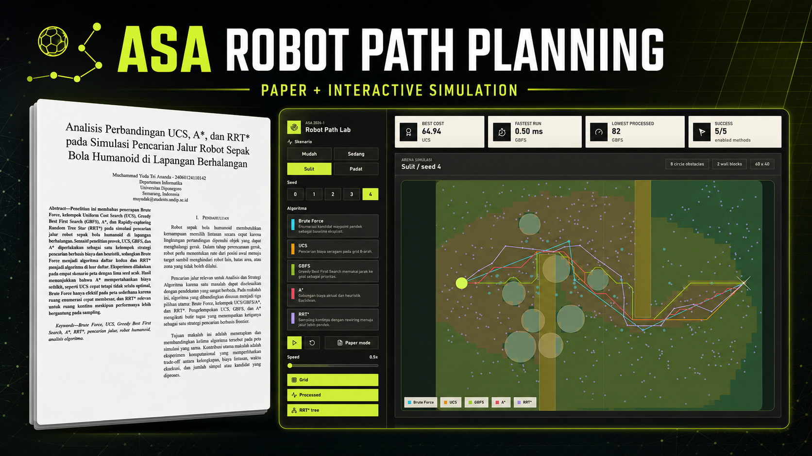

# ASA Robot Path Planning


> Proyek Makalah — Analisis dan Strategi Algoritma, Semester Genap 2025/2026  
> Departemen Informatika, Universitas Diponegoro

| | |
|---|---|
| **Nama** | Muchammad Yuda Tri Ananda |
| **NIM** | 24060124110142 |
| **Kelas** | Informatika E |
| **Makalah** | [📄 PDF](paper/) |
| **Video** | [▶ YouTube](https://youtu.be/gWvJh0jpOA?si=Jcxtga3KlfvjNRMc) |
| **Simulasi** | [🌐 Interactive Demo](https://myudak.github.io/Project-ASA-Analisis-Perbandingan-Path/) |

---

## Tentang Proyek

Makalah ini membandingkan lima algoritma pencarian jalur pada simulasi lapangan sepak bola robot humanoid berhalangan (60 × 40 satuan, hambatan lingkaran dan persegi panjang).

| Algoritma | Tipe | Dari Daftar |
|-----------|------|-------------|
| **Brute Force** | Enumerasi waypoint terbatas | ✅ Item (a) |
| **UCS** | Grid 8-arah, prioritas g(n) | ✅ Item (g) |
| **GBFS** | Grid 8-arah, prioritas h(n) | ✅ Item (g) |
| **A\*** | Grid 8-arah, prioritas g(n)+h(n) | ✅ Item (g) |
| **RRT\*** | Sampling kontinu + rewiring | 🔵 Di luar daftar |

Eksperimen utama dijalankan pada **4 skenario** (Mudah → Padat) × **10 seed peta feasible**. Setiap runtime diukur tiga kali dan nilai median per peta digunakan sebelum agregasi. Analisis tambahan menguji enam resolusi grid dan enam tingkat kepadatan hambatan.

---

## Struktur Repositori

```
.
├── paper/                  # Makalah final (PDF + DOCX)
├── docs/
│   ├── assignment/         # Deskripsi tugas
│   └── template/           # Template IEEE
├── src/
│   └── asa_path_planning/  # Kode eksperimen Python
├── notebooks/              # Notebook eksperimen dan analisis lengkap
├── results/
│   ├── data/               # CSV hasil eksperimen
│   └── figures/            # Gambar output
├── simulation/             # Aplikasi React/Vite interaktif
├── dist/                   # Arsip ZIP untuk submission
└── archive/                # Draft dan aset lama
```

---

## Reproduksi Eksperimen

### Requirements

- Python **3.12+**
- [`uv`](https://docs.astral.sh/uv/) — Python package & project manager

### Instalasi & Menjalankan

```powershell
uv lock
uv run asa-path-planning
```

Suite dapat dijalankan terpisah:

```powershell
uv run asa-path-planning --suite main
uv run asa-path-planning --suite scaling
uv run asa-path-planning --suite density
```

Output yang dihasilkan secara default:

```
results/data/hasil_eksperimen.csv       ← data mentah per seed
results/data/ringkasan_eksperimen.csv   ← rata-rata & std dev per skenario
results/data/hasil_grid_scaling.csv
results/data/ringkasan_grid_scaling.csv
results/data/hasil_density_sweep.csv
results/data/ringkasan_density_sweep.csv
results/figures/fig_perbandingan_jalur.png
results/figures/fig_waktu_rata_rata.png
results/figures/fig_processed_grid.png
results/figures/fig_grid_scaling.png
results/figures/fig_density_sweep.png
```

### Custom Output Directory

```powershell
uv run asa-path-planning --data-dir results/data --figures-dir results/figures
```

---

## Notebook Analisis

Notebook menggunakan fungsi dari `src/asa_path_planning/`, sehingga implementasi
algoritma tetap memiliki satu sumber kebenaran.

```powershell
uv sync --extra notebook
uv run --extra notebook jupyter lab notebooks/analisis_path_planning.ipynb
```

Notebook menjalankan kelima algoritma pada satu kasus lengkap, memvalidasi lintasan,
memvisualisasikan peta dan pohon RRT*, lalu menganalisis seluruh data mentah untuk
keberhasilan, detour ratio, runtime, processed, audit solvability, scaling grid,
robustness terhadap kepadatan, dan variasi antarseed.

---

## Simulasi Interaktif

Aplikasi pendamping berbasis React/Vite ada di `simulation/`, dan juga tersedia secara online di **[myudak.github.io/Project-ASA-Analisis-Perbandingan-Path](https://myudak.github.io/Project-ASA-Analisis-Perbandingan-Path/)**.

### Requirements

- [Node.js](https://nodejs.org/) 18+
- [`pnpm`](https://pnpm.io/)

### Development

```powershell
cd simulation
pnpm install
pnpm dev
```

### Production Build

```powershell
cd simulation
pnpm build
```

> **Paper mode** — preset di aplikasi yang membuka skenario `Sulit` seed `4`, identik dengan Figure 1 pada makalah.

---

## Hasil Ringkas

| Skenario | Algoritma Terbaik (Biaya) | Algoritma Tercepat | Catatan |
|----------|--------------------------|-------------------|---------|
| Mudah | Brute Force (53.36) | GBFS (8.3 ms) | Semua berhasil 100% |
| Sedang | A* / UCS (55.40) | GBFS (18.7 ms) | Brute Force berhasil 80% |
| Sulit | A* / UCS (70.35) | GBFS (29.1 ms) | Brute Force 20%; RRT* 90% |
| Padat | A* / UCS (57.06) | GBFS (20.1 ms) | Brute Force berhasil 30% |

**Kesimpulan utama:** A\* mempertahankan biaya UCS pada seluruh peta grid feasible
dengan eksplorasi lebih terarah. Sweep kepadatan menunjukkan Brute Force paling
cepat kehilangan reliabilitas, sedangkan scaling grid memperlihatkan pertumbuhan
runtime UCS dan A* yang mendekati linear terhadap jumlah sel pada rentang pengujian.
